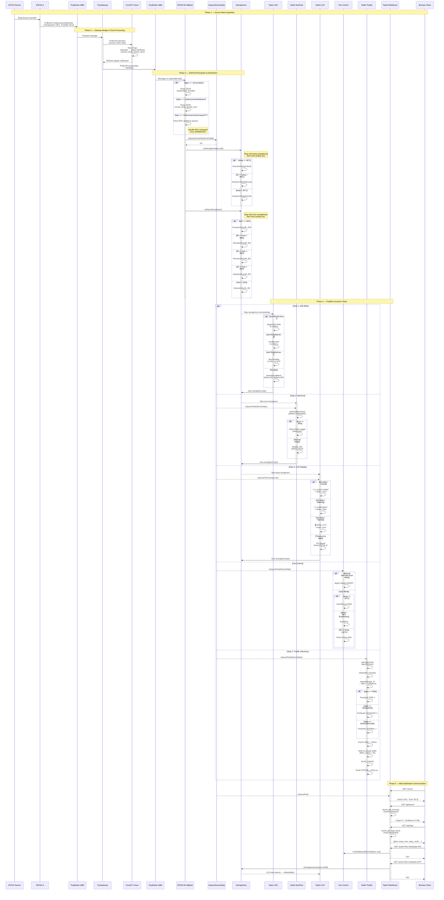

```mermaid
sequenceDiagram
    participant DHT as DHT22 Sensor
    participant A as ESP32-A
    participant TB1 as TinyBroker:1883
    participant GW as TinyGateway
    participant Cloud as CoreIOT Cloud
    participant TB2 as TinyBroker:1884
    participant CB as ESP32-B Callback
    participant Q as xQueueSensorData
    participant SEM as Semaphores
    participant LED as Task1 LED
    participant NEO as Task2 NeoPixel
    participant LCD as Task3 LCD
    participant FAN as Fan Control
    participant ML as Task5 TinyML
    participant WEB as Task4 WebServer
    participant UI as Browser Client

    Note over DHT, UI: Phase 1 — Sensor Data Acquisition

    DHT->>A: Read temp & humidity
    activate A
    A->>TB1: PUBLISH v1/devices/me/telemetry<br/>{"temperature":28.5, "humidity":65.3}
    deactivate A

    Note over TB1, Cloud: Phase 2 — Gateway Bridge & Cloud Processing

    TB1->>GW: Forward message
    activate GW
    GW->>Cloud: PUBLISH telemetry<br/>(Access Token auth)
    activate Cloud
    Cloud->>Cloud: Rule Chain:<br/>telemetry → shared attributes<br/>{remote_temp, remote_hum}
    Cloud-->>GW: Attribute update notification
    deactivate Cloud
    GW->>TB2: PUBLISH sensor/data<br/>+ attributes
    deactivate GW

    Note over TB2, SEM: Phase 3 — ESP32-B Reception & Distribution

    TB2->>CB: Message on subscribed topic
    activate CB

    alt topic == "sensor/data"
        CB->>CB: Parse JSON:<br/>temperature, humidity
    else topic == "v1/devices/me/attributes"
        CB->>CB: Parse JSON:<br/>remote_temp, remote_hum
    else topic == "v1/devices/me/rpc/request/*"
        CB->>CB: Parse RPC method & params
        Note right of CB: Handle RPC command<br/>(e.g. setStateLED)
    end

    CB->>Q: xQueueOverwrite(SensorData)
    activate Q
    Q-->>CB: OK
    deactivate Q

    CB->>SEM: setSemaphoreByLevel()
    activate SEM
    Note right of SEM: Clear all 3 temp semaphores<br/>then Give exactly one

    alt temp >= 38°C
        SEM->>SEM: Give(semTempCritical)
    else 30 <= temp < 38°C
        SEM->>SEM: Give(semTempWarning)
    else temp < 30°C
        SEM->>SEM: Give(semTempNormal)
    end

    deactivate SEM

    CB->>SEM: setHumSemaphore()
    activate SEM
    Note right of SEM: Clear all 5 hum semaphores<br/>then Give exactly one

    alt hum >= 90%
        SEM->>SEM: Give(semHum90_100)
    else 80 <= hum < 90%
        SEM->>SEM: Give(semHum80_90)
    else 50 <= hum < 80%
        SEM->>SEM: Give(semHum50_80)
    else 30 <= hum < 50%
        SEM->>SEM: Give(semHum30_50)
    else hum < 30%
        SEM->>SEM: Give(semHum0_30)
    end

    deactivate SEM
    deactivate CB

    Note over LED, WEB: Phase 4 — Parallel Consumer Tasks

    par Task 1: LED Blink
        SEM-->>LED: Take semaphore (non-blocking)
        activate LED
        alt semTempCritical
            LED->>LED: Rapid SOS blink<br/>5x 100ms
        else semTempWarning
            LED->>LED: Double-blink<br/>2x 300ms
        else semTempNormal
            LED->>LED: Slow breathe<br/>1s ON / 1s OFF
        else No data
            LED->>LED: Heartbeat fallback<br/>200ms ON / 800ms OFF
        end
        LED->>SEM: Give semaphore back
        deactivate LED

    and Task 2: NeoPixel
        SEM-->>NEO: Take hum semaphore
        activate NEO
        Q-->>NEO: xQueuePeek(SensorData)
        NEO->>NEO: getHumidityColor()<br/>gradient interpolation
        alt hum >= 90%
            NEO->>NEO: Flash 200ms toggle<br/>(deep blue)
        else Normal range
            NEO->>NEO: Steady color<br/>500ms refresh
        end
        NEO->>SEM: Give semaphore back
        deactivate NEO

    and Task 3: LCD Display
        SEM-->>LCD: Take temp semaphore
        activate LCD
        Q-->>LCD: xQueuePeek (timeout 8s)
        alt Got data + Critical
            LCD->>LCD: "⚠⚠ NGUY HIEM!"<br/>+ temp + hum
        else Got data + Warning
            LCD->>LCD: "⚠ CANH BAO!"<br/>+ temp + hum
        else Got data + Normal
            LCD->>LCD: "🌡 Temp: xx°C"<br/>"💧 Humi: xx%"
        else Timeout (no data)
            LCD->>LCD: "No Signal!<br/>Check ESP32-A"
        end
        LCD->>SEM: Give semaphore back
        deactivate LCD

    and Fan Control
        Q-->>FAN: xQueuePeek(SensorData)
        activate FAN
        alt Manual Override (from Web)
            FAN->>FAN: Apply manual ON/OFF
        else Auto Mode
            alt temp >= 30°C
                FAN->>FAN: FanON() via PWM
            else temp < 28°C (hysteresis)
                FAN->>FAN: FanOFF()
            else 28 <= temp < 30°C
                FAN->>FAN: Keep current state
            end
        end
        deactivate FAN

    and Task 5: TinyML Inference
        Q-->>ML: xQueuePeek(SensorData)
        activate ML
        ML->>ML: input.f[0]=temp<br/>input.f[1]=hum
        ML->>ML: interpreter->Invoke()
        ML->>ML: argmax(output, 3)<br/>→ class + confidence
        alt class == FIRE
            ML->>ML: Predicted: FIRE 🔥
        else class == NUISANCE
            ML->>ML: Predicted: NUISANCE ⚠
        else class == BACKGROUND
            ML->>ML: Predicted: NORMAL ✓
        end
        ML->>ML: tinyml_lock() — Mutex
        ML->>ML: Write to circular buffer<br/>(MAX_LOGS = 20)
        ML->>ML: tinyml_unlock()
        ML->>ML: Serial: [TINYML_LOG],csv...
        deactivate ML
    end

    Note over WEB, UI: Phase 5 — Web Dashboard Communication

    UI->>WEB: GET /sensor
    activate WEB
    Q-->>WEB: xQueuePeek
    WEB-->>UI: {"temp":28.5, "hum":65.3}
    deactivate WEB

    UI->>WEB: GET /api/tinyml
    activate WEB
    WEB->>WEB: tinyml_get_metrics()<br/>(mutex-protected)
    WEB-->>UI: {"class":0, "confidence":0.95}
    deactivate WEB

    UI->>WEB: GET /api/logs
    activate WEB
    WEB->>WEB: tinyml_get_logs_json()<br/>(mutex-protected)
    WEB-->>UI: [{time, temp, hum, class, conf}, ...]
    deactivate WEB

    UI->>WEB: GET /action?dev=fan&state=ON
    activate WEB
    WEB->>FAN: FanSetManualOverride(true, true)
    WEB-->>UI: "OK"
    deactivate WEB

    UI->>WEB: GET /action?dev=lcd&state=OFF
    activate WEB
    WEB->>SEM: xSemaphoreGive(semLcdOff)
    SEM-->>LCD: LCD task detects → noBacklight()
    WEB-->>UI: "OK"
    deactivate WEB
```
